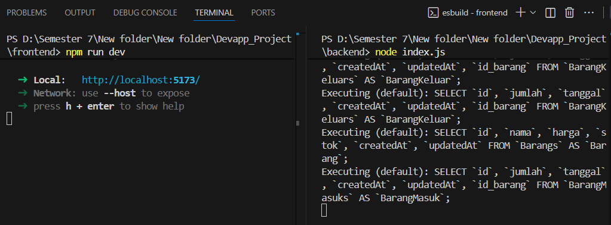

# Cara Instalasi Project

## ⚡ Prasyarat

Pastikan sudah terinstal:

- Node.js (disarankan versi 18+)
- npm atau yarn
- MySQL (misal via XAMPP / Laragon)
- Visual Studio Code (opsional)

---

## 🔧 Instalasi Backend

1. Buka terminal, masuk ke folder backend:

```bash
cd backend
```

2. Install dependencies:

```bash
npm install
```

3. Jalankan Database MySQL dan buat database:

```sql
CREATE DATABASE crud_task;
```

4. Jalankan server backend:

```bash
node index.js
```

5. Backend berjalan di:

```
http://localhost:5000
```

---

## 🔧 Instalasi Frontend

1. Buka terminal baru, masuk ke folder frontend:

```bash
cd frontend
```

2. Install dependencies:

```bash
npm install
```

3. Jalankan frontend:

```bash
npm run dev
```

4. Frontend berjalan di:

```
http://localhost:5173
```

---


